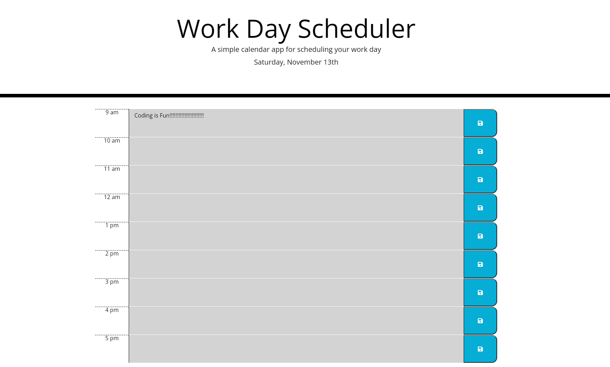

# Work Day Scheduler 

## Description
This project was created to allow users to save events for each hour of a normal work day. The Moment library was used so that the scheduler will reflect how many hours are left in their day so they can plan accordingly.

## Table of Contents
- [Technologies](#technologies)
- [Preview](#preview)
- [Launch](#launch)

## Technologies
- HTML
- CSS
- JavaScript
- Moment.js
## Preview

## Launch
[Github Pages](https://negronmarc.github.io/Work-Day-Scheduler/)